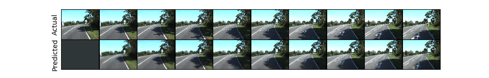

# PredNet_pytorch

An implement of PredNet in pytorch. See the paper [Deep predictive coding networks for video prediction and unsupervised learning](https://arxiv.org/abs/1605.08104) in ICLR 2017 for more details.

## Some example results

